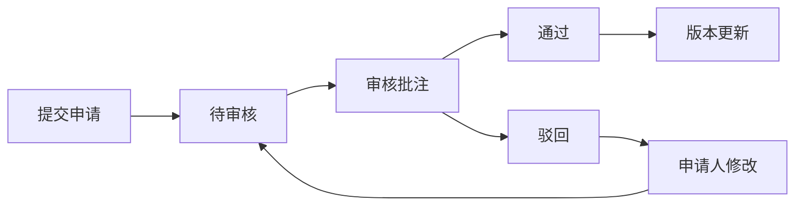
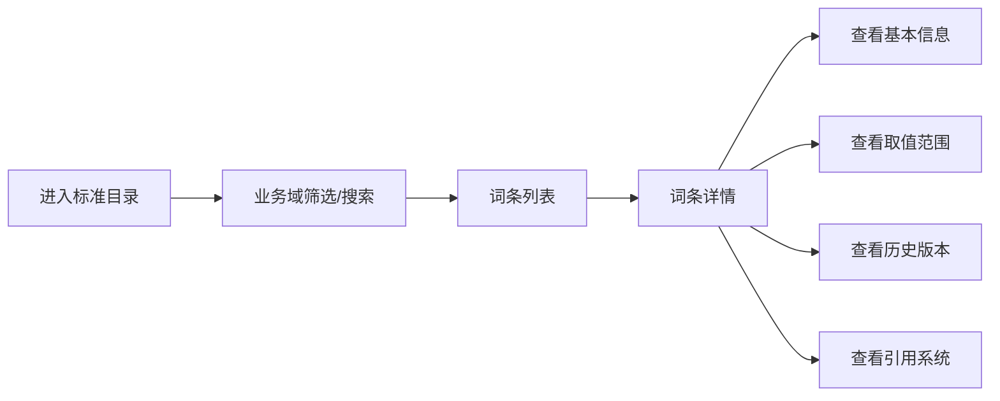

## 1. 产品概述

数据标准字典库是企业级数据治理平台的核心组件，为各业务线提供统一的数据标准查询、维护和审核服务。通过标准化数据定义，消除数据歧义，提升数据质量和业务协同效率。

- 主要目标用户：数据分析师、业务人员、数据治理专员、系统开发者
- 核心价值：统一数据口径、降低沟通成本、保障数据质量、支撑数据共享

## 2. 核心功能

### 2.1 用户角色

| 角色 | 描述 | 核心权限 |
|------|------|----------|
| 普通用户 | 业务人员、数据分析师 | 浏览标准、提交申请、查询引用 |
| 标准负责人 | 各业务域数据标准负责人 | 维护词条、审核申请、管理同义词/禁用词 |
| 管理员 | 数据治理团队 | 批量导入、系统配置、全量审核 |

### 2.2 功能模块

1. **标准目录页**：业务域导航、词条列表、高级筛选、搜索
2. **词条详情页**：基本信息、取值范围、示例、同义词/禁用词、历史版本、引用系统
3. **标准申请页**：新增申请、修改申请、批量导入、申请列表
4. **审核中心页**：待审核列表、在线批注、通过/驳回、审核历史
5. **引用查询页**：系统列表、引用关系、影响分析

### 2.3 页面详情

| 页面名称 | 模块名称 | 功能描述 |
|-----------|-------------|---------------------|
| 标准目录 | 左侧业务域树 | 按层级浏览业务域，点击筛选词条 |
| 标准目录 | 顶部搜索栏 | 支持中英文搜索、模糊匹配 |
| 标准目录 | 筛选条件区 | 按状态、负责人、更新时间筛选 |
| 标准目录 | 词条列表 | 展示词条基本信息、状态标签、操作按钮 |
| 词条详情 | 基本信息区 | 中文名、英文名、编码、业务域、状态、负责人 |
| 词条详情 | 含义说明 | 富文本展示词条含义和业务规则 |
| 词条详情 | 取值范围 | 枚举值列表或数值范围展示 |
| 词条详情 | 示例展示 | 数据示例和使用场景说明 |
| 词条详情 | 同义词/禁用词 | 同义词标签、禁用词警示 |
| 词条详情 | 版本历史 | 历史版本对比、版本回溯 |
| 词条详情 | 引用系统 | 引用该标准的系统列表 |
| 标准申请 | 申请表单 | 新增/修改词条信息填写 |
| 标准申请 | 批量导入 | Excel 模板下载、上传解析、预览确认 |
| 标准申请 | 我的申请 | 申请列表、状态跟踪、撤回操作 |
| 审核中心 | 待审核列表 | 待办审核项、快捷操作 |
| 审核中心 | 审核详情 | 变更对比、批注功能、通过/驳回 |
| 审核中心 | 审核记录 | 历史审核记录、审批流展示 |
| 引用查询 | 系统列表 | 业务系统清单、系统信息 |
| 引用查询 | 引用关系 | 系统与标准的引用关系图谱 |
| 引用查询 | 影响分析 | 标准变更对下游系统的影响 |

## 3. 核心流程

### 3.1 标准申请审核流程

用户在标准目录浏览词条，发现需要新增或修改时，提交标准申请。申请进入审核中心，由标准负责人进行审核，可添加批注后通过或驳回。审核通过后，词条正式生效并更新版本。

### 3.2 词条查询浏览流程

用户进入标准目录，通过左侧业务域导航或搜索功能找到目标词条，点击进入详情页查看完整信息，包括取值范围、示例、同义词、历史版本和引用系统。

## 4. 用户界面设计

### 4.1 设计风格

- **主色调**：深靛蓝 (#1e3a5f) - 体现专业、可信赖的企业级产品气质
- **辅助色**：青绿色 (#0ea5e9) - 用于高亮、交互元素
- **强调色**：琥珀色 (#f59e0b) - 用于警告、待办事项
- **成功色**：翡翠绿 (#10b981) - 用于通过、生效状态
- **危险色**：玫红色 (#ef4444) - 用于驳回、错误状态
- **中性色**：石板灰系列 - 用于文字、背景、边框

- **按钮风格**：圆角 6px，悬停有微妙阴影和颜色加深效果
- **字体**：思源黑体 / PingFang SC / system-ui，清晰易读的现代无衬线字体
- **布局风格**：左侧导航 + 顶部工具栏 + 主内容区的经典企业级三栏布局
- **卡片设计**：轻量边框 + 细微阴影，内容分区清晰
- **图标风格**：线性图标，20px 尺寸，与文字对齐

### 4.2 页面设计概述

| 页面名称 | 模块名称 | UI 元素 |
|-----------|-------------|----------|
| 标准目录 | 业务域树 | 可折叠树形结构，层级缩进，选中高亮 |
| 标准目录 | 搜索栏 | 大输入框，搜索图标，快捷筛选标签 |
| 标准目录 | 词条卡片 | 标题+描述+标签的列表项布局，悬停微交互 |
| 词条详情 | 信息分栏 | 左右两栏布局，左基本信息右详细内容 |
| 词条详情 | Tab 切换 | 选项卡切换不同信息模块 |
| 词条详情 | 版本时间轴 | 垂直时间轴展示版本历史 |
| 标准申请 | 表单 | 分组表单，必填项标记，实时校验 |
| 标准申请 | 上传区 | 拖拽上传，文件预览，进度条 |
| 审核中心 | 审核卡片 | 申请摘要，状态角标，快捷操作按钮 |
| 审核中心 | 对比视图 | 左右分栏对比变更前后内容 |
| 引用查询 | 系统卡片 | 网格布局展示系统信息 |
| 引用查询 | 关系图 | 力导向关系图展示引用关系 |

### 4.3 响应式设计

- 桌面端（1280px+）：完整三栏布局，侧边导航展开
- 平板端（768-1279px）：侧边导航可收起，内容区自适应
- 移动端（<768px）：顶部导航下拉菜单，列表堆叠展示

### 4.4 动效设计

- 页面切换：淡入 + 轻微上移动画
- 卡片悬停：背景色加深 + 阴影增强 + 上移 2px
- 展开收起：平滑高度过渡
- 加载状态：骨架屏脉冲动画
- 按钮点击：缩放反馈
