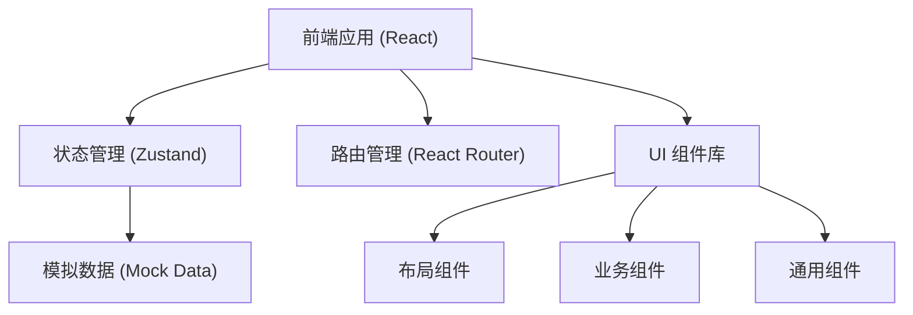
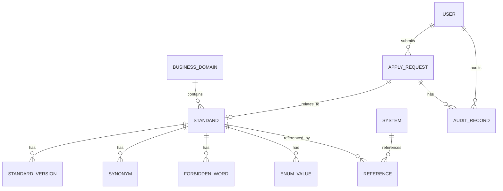

## 1. 架构设计



## 2. 技术描述

- **前端框架**：React 18 + TypeScript
- **构建工具**：Vite 5
- **样式方案**：Tailwind CSS 3
- **路由管理**：react-router-dom 6
- **状态管理**：Zustand
- **图标库**：lucide-react
- **数据方案**：前端 Mock 数据（纯前端演示，无后端）

## 3. 路由定义

| 路由路径 | 页面名称 | 说明 |
|----------|----------|------|
| / | 标准目录 | 首页，业务域导航和词条列表 |
| /standard/:id | 词条详情 | 单个标准词条的完整信息展示 |
| /apply | 标准申请 | 新增/修改申请、批量导入 |
| /audit | 审核中心 | 待审核列表、审核操作 |
| /reference | 引用查询 | 系统列表、引用关系查询 |

## 4. 数据模型

### 4.1 数据实体关系



### 4.2 核心数据类型定义

```typescript
// 业务域
interface BusinessDomain {
  id: string;
  name: string;
  code: string;
  parentId: string | null;
  children?: BusinessDomain[];
  standardCount: number;
}

// 标准词条
interface Standard {
  id: string;
  nameCn: string;
  nameEn: string;
  code: string;
  domainId: string;
  domainName: string;
  status: 'draft' | 'effective' | 'deprecated';
  dataType: 'string' | 'number' | 'boolean' | 'date' | 'enum';
  meaning: string;
  valueRange: string;
  example: string;
  owner: string;
  version: string;
  createdAt: string;
  updatedAt: string;
  synonyms: Synonym[];
  forbiddenWords: ForbiddenWord[];
  enumValues: EnumValue[];
}

// 同义词
interface Synonym {
  id: string;
  name: string;
  type: 'alias' | 'abbreviation';
}

// 禁用词
interface ForbiddenWord {
  id: string;
  name: string;
  reason: string;
}

// 枚举值
interface EnumValue {
  id: string;
  code: string;
  name: string;
  description: string;
}

// 历史版本
interface StandardVersion {
  id: string;
  standardId: string;
  version: string;
  content: Partial<Standard>;
  changeLog: string;
  operator: string;
  createdAt: string;
}

// 申请单
interface ApplyRequest {
  id: string;
  type: 'create' | 'update' | 'deprecated';
  status: 'pending' | 'approved' | 'rejected';
  standardId?: string;
  standardData: Partial<Standard>;
  applicant: string;
  applyReason: string;
  submitTime: string;
  auditRecords: AuditRecord[];
}

// 审核记录
interface AuditRecord {
  id: string;
  requestId: string;
  auditor: string;
  result: 'approved' | 'rejected';
  comment: string;
  auditTime: string;
}

// 业务系统
interface BusinessSystem {
  id: string;
  name: string;
  code: string;
  description: string;
  owner: string;
  standardCount: number;
}

// 引用关系
interface Reference {
  id: string;
  standardId: string;
  standardName: string;
  systemId: string;
  systemName: string;
  usage: string;
  referencedAt: string;
}

// 用户
interface User {
  id: string;
  name: string;
  role: 'user' | 'owner' | 'admin';
  avatar?: string;
}
```

## 5. 目录结构

```
src/
├── components/          # 通用组件
│   ├── Layout/          # 布局组件
│   │   ├── Sidebar.tsx
│   │   ├── Header.tsx
│   │   └── index.tsx
│   ├── ui/              # 基础 UI 组件
│   │   ├── Button.tsx
│   │   ├── Input.tsx
│   │   ├── Tag.tsx
│   │   ├── Badge.tsx
│   │   ├── Card.tsx
│   │   ├── Tabs.tsx
│   │   ├── Modal.tsx
│   │   └── Table.tsx
│   └── standard/        # 标准相关组件
│       ├── DomainTree.tsx
│       ├── StandardCard.tsx
│       ├── StandardList.tsx
│       ├── FilterBar.tsx
│       └── VersionTimeline.tsx
├── pages/               # 页面组件
│   ├── Catalog.tsx      # 标准目录
│   ├── StandardDetail.tsx # 词条详情
│   ├── Apply.tsx        # 标准申请
│   ├── Audit.tsx        # 审核中心
│   └── Reference.tsx    # 引用查询
├── store/               # 状态管理
│   ├── useStandardStore.ts
│   ├── useApplyStore.ts
│   ├── useAuditStore.ts
│   └── useUserStore.ts
├── data/                # 模拟数据
│   ├── standards.ts
│   ├── domains.ts
│   ├── systems.ts
│   ├── applies.ts
│   └── users.ts
├── types/               # TypeScript 类型
│   └── index.ts
├── utils/               # 工具函数
│   ├── format.ts
│   └── search.ts
├── App.tsx
├── main.tsx
└── index.css
```

## 6. 状态管理设计

使用 Zustand 进行状态管理，按业务模块划分 store：

- **useStandardStore**：标准词条数据、筛选条件、搜索关键词
- **useApplyStore**：申请列表、申请详情、表单数据
- **useAuditStore**：待审核列表、审核操作
- **useUserStore**：当前用户信息、权限判断

## 7. 核心交互流程

### 7.1 词条查询流程
1. 进入标准目录页面
2. 初始化加载业务域树和词条列表
3. 用户点击业务域/输入关键词/选择筛选条件
4. 更新 store 中的筛选状态
5. 根据筛选条件过滤词条列表
6. 重新渲染列表

### 7.2 标准申请流程
1. 用户点击"新增标准"或"申请修改"
2. 打开申请表单，填充初始数据
3. 用户填写表单并提交
4. 创建申请单，状态为"待审核"
5. 申请进入审核中心待办列表

### 7.3 审核流程
1. 审核人进入审核中心
2. 查看待审核列表
3. 点击某条申请查看详情
4. 对比变更内容，添加批注
5. 点击通过或驳回
6. 更新申请状态，生成审核记录
7. 如通过，同步更新标准词条和版本
